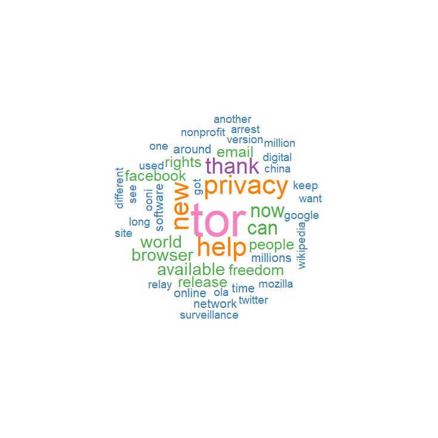
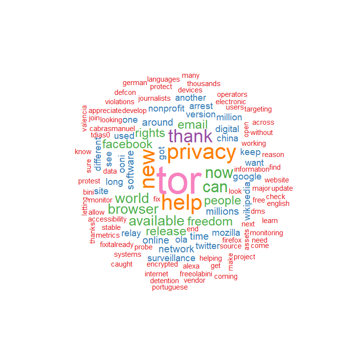
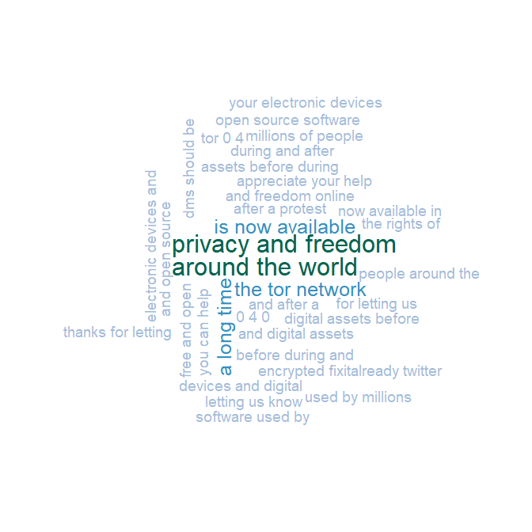

## Introduction

Every day, users willingly or unknowingly give up compromising information to the websites and networks they use. Whether it be uploading photos with location based meta-data attached or having internet traffic analyzed on a public network, identifying the user. Even to the point of allowing websites to farm user information to create profiles for marketing or other purposes. Privacy is an important issue and people are not protecting themselves. With privacy appearing to be difficult to achieve for less-technically savvy people, the development of the Tor Browser was an initiative to combat that. As people’s awareness of tracking, surveillance, and censorship has increased, so has the hindrances to prevent internet freedom. The Tor Project is a network that has thousands of relays run by volunteers and users around the world. It provides anonymity and security for users, while fighting for an uncensored, unrestricted internet. It is one of the strongest tools for privacy and freedom online. 

This project will aim to analyze the tweets and users surrounding the Tor Project twitter account. As they are on the forefronts of internet freedom the discussion around certain topics and events will be our focus. We also aim to look at the users who are passionate about the Tor Project, and see if they practice proper privacy methods. This project will utilize the R language for our data visualization and manipulation, as well as the Twitter API for sourcing our data


## Environment Setup

In order to harvest tweets, the following will be required. This project assumes that you already have a Twitter developer account with an application and the respective keys for API access.

```js
install.packages("twitteR")
install.packages("ROAuth")
install.packages("tokenizers")
install.packages("wordcloud")
install.packages("tm")
install.packages("ggplot2")
install.packages("XML")
install.packages("igraph")

library(twitteR)
library(ROAuth)
library(wordcloud)
library(RColorBrewer)
library(tokenizers)
library(tm)
library(ggplot2)
library(XML)
library(igraph)
```

Our Twitter API credentials are stored in a Rdata file titled cred611. We will create a handshake between our RStudio workspace and Twitter

```js
load(file="cred611.rdata")
setup_twitter_oauth(cred611$consumerKey, cred611$consumerSecret, cred611$oauthKey, cred611$oauthSecret)
```


## The Tor Project’s User Account

The primary focus of our project will be the @torproject Twitter account. This account will be the root of our project. We will analyze their timeline, followers, accounts interacted with, and keywords associated with their operations. We will associate this Twitter account with the screenname variable. 

```js
screenname="torproject";
user <- getUser(screenname)
```

We can now issue commands associated with the user variable to get information regarding the Tor Project twitter account. We can find the current number of followers, the number of people they follow, the number of tweets they have issued, as well as when the account was created. 

```
user$followersCount 		#shows the current number of followers the account has
user$friendsCount		#shows the number of accounts @torproject follows
user$statusesCount		#shows the number of tweets that have been tweeted
user$created		#returns the date that the account was created on the Twitter platform
user$verified		#returns whether the account has been verified as authentic by Twitter
```

The account currently has 293,603 followers, 1,319 users followed, and 7,645 tweets since its creation 11 years ago on December 30, 2008. We can also see that the account is authentic, because verified returns ‘TRUE’. This information is simple but useful, as it allows us to see the type of reach @torproject has. We can assume that the account is rather active, with an average of 1.9 tweets per day. But in the grand scheme of things, this number is low when compared to other Twitter and media accounts. @torproject tweets mostly about development updates towards their platform as well as information and news regarding current events in the technology, security and data sector. We can assume that most of our data will be related to these topics and have an expectation of what to expect.


## The Tor Project’s Timeline Tweets

Now that we have a basis of what @torproject is about, we will have a better understanding of what we are looking at when we pick apart their tweets. We will first only pull the user’s tweets from their timeline.

```js
tweets <- userTimeline(user,n=1000, maxID=NULL, sinceID=NULL)
```

This will give us only the tweets @torproject has tweeted out. However, since they average about 1.9 tweets per day, and the Twitter API has restrictions, we only ended up with a small number of tweets dating back to the beginning of March 2019. This can be found in our ‘tweetsBase.Rdata’ file. Even when specifying the sinceID attribute with the ID of the last tweet in our data frame, the Twitter API prevents us from pulling tweets further back. We mentioned earlier that @torproject has engagement in the cyber security and privacy sector, so we’re going to pull the Twitter timeline with included retweets. 

```js
tweetsFull <- userTimeline(user,n=1000, maxID=NULL, sinceID=NULL, includeRts=TRUE)
```

This uses the previous line of code, but instead adds the ‘includeRts’ attribute with it set to to ‘TRUE’. This changes our pull method to include the retweets of the user that display on their timeline. This has been saved in our ‘tweetsFullBase.Rdata’ file. Since @torproject’s tweet amount in the past few months is rather low at around 100 tweets, this will give us a better representation of the user and their twitter timeline. Now that we have data, we need to clean it up before we can move on to visualization.


## Cleaning Up the Data
We will use the below functions to strip any unwanted text, spaces, or characters from our data. This will allow us to get a better understanding of what we are looking at, as well as making it appear nicer and complete in any visualizations. 

```
removeNonASCII<- function(txt){	#This removes all non-ASCII characters from the text
  return(iconv(txt, to="ASCII", sub=""))
}
removeCntrls<- function(x){		#Removes all control characters
  x<- gsub("[[:cntrl:]]",  "",x)
  return(x)
}
removeURLs <- function(x){  		#Removes all embedded URLs
  x<- gsub("http(s?)://[[:alnum:]].\\S*", " ", x)
  x<- gsub("http(s?):/.*$", " ",x)
  return(x)
}
removeRT<- function(x){    		#Removes all Retweet symbols: RT & @
  x<- gsub("(^RT|^MRT) @", "@",x, ignore.case=TRUE)
  return(x)
}
removeQuotes<- function(x){		#Removes all slashes
  return(gsub("\'|\"", " ", x))
}
removeNewLines<- function(x){		#Removes any new line indicators
  x<- gsub("[\r\n]",  " ",x)
  return(x)
}
removeColons<- function(x){		#Removes all colons from the text
  x<- gsub(":",  " ",x)
  return(x)
}
removePeriods<- function(x){		#Strips all periods
  x<- gsub("[.]",  " ",x)
  return(x)
}
removeMany<- function(x){	#Strips remaining characters: &, /, quotations, http link headings
  x<- gsub("&.*;",  " ",x)
  x<- gsub("/",  " ",x)
  x<- gsub(",",  " ",x)
  x<- gsub(" http",  " ",x)
  x<- gsub("http ",  " ",x)
}
removeExtraSpaces<- function(x){	#Removes any remaining unnecessary spaces
  x<- gsub("[[:space:]]+",  " ",x)
  return(x)
}
removeLeadingTrailingSpaces<- function(x){	#Removes any spaces at the front or end of the text
  x<- gsub("^[[:space:]]",  "",x)
  x<- gsub("[[:space:]]$",  "",x)
  return(x)
}
```

Calling these functions in relation to our code, will produce a clean and stripped format where we can clearly see and understand the text of the Twitter data. We do this for both our prior data frames: tweetsDF and tweetsFullDF. The corresponding data is stored in the Rdata files: tweetsClean.Rdata and tweetsFullClean.Rdata.


## Timeline Word Clouds
The above functions stripped our text of any undesirables, making our data ideal for visualization. Let’s first look at our tweetsDF data, the 91 raw tweets pulled from @torproject’s timeline, with a simple word cloud. 

```js
set.seed(9999)
wordcloud(tweetsDF$text,scale=c(5, .4), random.order=FALSE, colors=brewer.pal(8,"Set1"))
```

This produces the following word cloud:


Pretty simple, right? Well, what we can see from this word cloud are some of the most commonly used words in our tweetsDF list. These are the words that have appeared at least 3 times in the past two months in @torproject’s tweets (3 is the default if min.freq is left blank). While the number of words listed are rather small, I think the ones displayed are useful. The one that really stands out is “tor” in pink. That’s the name of their free and open-source software for enabling anonymous communication. That’s what @torproject is all about, so it makes sense it would be the most commonly used word in their tweets. Other words that stand out are in orange: “new”, “privacy”, and “help”. Privacy is the main initiative behind the Tor Project, so it makes sense it would be a commonly used word. As Twitter is a platform to communicate that helps companies and individuals communicate with users, it seems like “new” could be related to @torproject reminding their users of new version releases of their software. Overall, I think a lot of the words included paint a decent picture. You can see words emphasized like: “world”, “browser”, “freedom”, “people” and “rights” which are all representative of @torproject. They provide a browser based on the Firefox framework to provide security and access to the Tor network. Due to tor’s network of nodes, they have global reach that is intended to bring people freedom and human rights to everyone. You can even see companies like “facebook” and “google” in there, as both have become controversial for their data privacy, and ethical reasons. While the data is rather small, this is a good representation of what the Tor Project stands for.

I tried modifying the word cloud attributes, and while decreasing the minimum frequency to two, more words were displayed. But I believe the word cloud above paints a much better picture than the following. 



The words in red which were added as a result of a lower standard of appearance, seem to clutter up the image and are filled with words that are not as powerful. You see usernames and more common words that take away from the importance of those emphasized. For example the words “tdias0”, “cabrasmanuel”, “dms” and others don’t have as much of a meaning or a message as those near the heart of the circle. Lets try tweaking our word cloud again, but this time to show sentence fragments rather than individual words. The code below gives us a 3-gram word cloud.

```javascript
grams_3 <- tokenize_ngrams(tweetsDF$text, n = 3, n_min = 3,lowercase=TRUE)
unlist(grams_3)
g3<- table(unlist(grams_3))

set.seed(9999)
wordcloud(words=names(g3), freq=g3, scale=c(2, .4), random.order=FALSE,
          colors=brewer.pal(8, "PuBuGn"), random.color=FALSE, rot.per=0.22,
          min.freq=2, max.words=Inf)
```

Keeping the seed at 9999, we split our data into a 3-gram word cloud. Compared to our original word cloud method, we assigned the words with our new data, as well as changing the scale to fit the words in the display. We changed the color code for a better visualization, as well as removing random assignment of color. This means that the text color will be coordinated with word frequency and will change as positioning in the word cloud changes. We kept the same minimum frequency, to get a better range of data. In a short period of time, having strings of words repeat themselves is more significant than reoccurring words with no meaning. 



Immediately you can tell that changing the color code paints a much better picture of the data. Using the 3-gram word cloud style we can also get a better understanding of some of the individual words we saw in our previous word clouds. The first strings that stand out are “privacy and freedom” and “around the world”. These correlate to our previous individual words of “privacy”, “freedom” and “world” but now you can see more of the context behind it. Privacy and freedom as said before is Tor’s initiative, and they have a global reach due to the nodes that are spread “around the world”. I really like this representation of our timeline much better than the singular word cloud.

However, we need to remember that this data is only showing a glimpse of what @torproject is all about. Lets try to get a bigger picture using our tweetsFullDF data, which contains roughly 3,200 tweets dating back to 2017.


We used a similar word cloud formula from our first visualization but made some minor adjustments to better fit our data. Our minimum frequency is set to 3, due to the large amount of text data we have, as well as a maximum word restriction was set to 500.

Immediately you can notice similarities with our first visualization that had a tweet size of 91. The words “tor”, “thank”, “privacy”, “browser”, and “new” are all reoccurring and emphasized. However, we also have some new words added to the mix. We can see that “censorship”, “surveillance”, “onion”, “eff” and “mozilla” have been emphasized in our new word cloud. Censorship is something the tor browser aims to counteract and surveillance has been a prominent topic for news and ethic debates in technology, so it’s not surprising it has appeared numerous times in their tweets. Onion refers to the onion router, the anonymizing network which is the heart of the tor project. In fact, tor’s name is an acronym for the onion router. And Eff is a nonprofit organization which shares news regarding civil liberties and privacy in the technology sector. Mozilla is the framework on which the tor browser has been built, as it uses a modified version of Firefox. And we’ll see that Mozilla is more present in @torproject’s tweets when we look at a 3-gram word cloud for this data set. 

```
*Difficulty: a thing that is hard to accomplish, deal with, or understand.*
```
