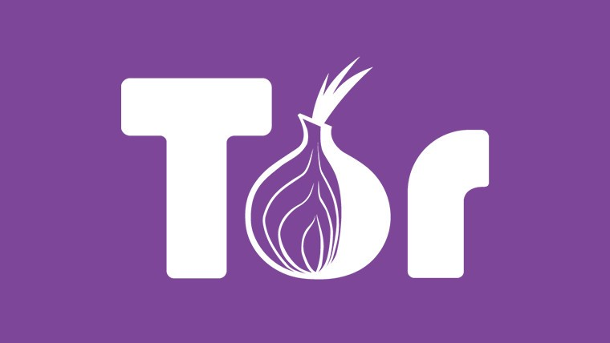*A twitter visualization project using R for the 410 Data Mining course at Manhattan College*

## Introduction

Every day, users willingly or unknowingly give up compromising information to the websites and networks they use. Whether it be uploading photos with location based meta-data attached or having internet traffic analyzed on a public network, identifying the user. Even to the point of allowing websites to farm user information to create profiles for marketing or other purposes. Privacy is an important issue and people are not protecting themselves. With privacy appearing to be difficult to achieve for less-technically savvy people, the development of the Tor Browser was an initiative to combat that. As people’s awareness of tracking, surveillance, and censorship has increased, so has the hindrances to prevent internet freedom. The Tor Project is a network that has thousands of relays run by volunteers and users around the world. It provides anonymity and security for users, while fighting for an uncensored, unrestricted internet. It is one of the strongest tools for privacy and freedom online. 

This project will aim to analyze the tweets and users surrounding the Tor Project twitter account. As they are on the forefronts of internet freedom the discussion around certain topics and events will be our focus. We also aim to look at the users who are passionate about the Tor Project, and see if they practice proper privacy methods. This project will utilize the R language for our data visualization and manipulation, as well as the Twitter API for sourcing our data


## Environment Setup

In order to harvest tweets, the following will be required. This project assumes that you already have a Twitter developer account with an application and the respective keys for API access.

```js
install.packages("twitteR")
install.packages("ROAuth")
install.packages("tokenizers")
install.packages("wordcloud")
install.packages("tm")
install.packages("ggplot2")
install.packages("XML")
install.packages("igraph")

library(twitteR)
library(ROAuth)
library(wordcloud)
library(RColorBrewer)
library(tokenizers)
library(tm)
library(ggplot2)
library(XML)
library(igraph)
```

Our Twitter API credentials are stored in a Rdata file titled cred611. We will create a handshake between our RStudio workspace and Twitter

```js
load(file="cred611.rdata")
setup_twitter_oauth(cred611$consumerKey, cred611$consumerSecret, cred611$oauthKey, cred611$oauthSecret)
```


## The Tor Project’s User Account

The primary focus of our project will be the @torproject Twitter account. This account will be the root of our project. We will analyze their timeline, followers, accounts interacted with, and keywords associated with their operations. We will associate this Twitter account with the screenname variable. 

```js
screenname="torproject";
user <- getUser(screenname)
```

We can now issue commands associated with the user variable to get information regarding the Tor Project twitter account. We can find the current number of followers, the number of people they follow, the number of tweets they have issued, as well as when the account was created. 

```
user$followersCount 		#shows the current number of followers the account has
user$friendsCount		#shows the number of accounts @torproject follows
user$statusesCount		#shows the number of tweets that have been tweeted
user$created		#returns the date that the account was created on the Twitter platform
user$verified		#returns whether the account has been verified as authentic by Twitter
```

The account currently has 293,603 followers, 1,319 users followed, and 7,645 tweets since its creation 11 years ago on December 30, 2008. We can also see that the account is authentic, because verified returns ‘TRUE’. This information is simple but useful, as it allows us to see the type of reach @torproject has. We can assume that the account is rather active, with an average of 1.9 tweets per day. But in the grand scheme of things, this number is low when compared to other Twitter and media accounts. @torproject tweets mostly about development updates towards their platform as well as information and news regarding current events in the technology, security and data sector. We can assume that most of our data will be related to these topics and have an expectation of what to expect.


## The Tor Project’s Timeline Tweets

Now that we have a basis of what @torproject is about, we will have a better understanding of what we are looking at when we pick apart their tweets. We will first only pull the user’s tweets from their timeline.

```js
tweets <- userTimeline(user,n=1000, maxID=NULL, sinceID=NULL)
```

This will give us only the tweets @torproject has tweeted out. However, since they average about 1.9 tweets per day, and the Twitter API has restrictions, we only ended up with a small number of tweets dating back to the beginning of March 2019. This can be found in our ‘tweetsBase.Rdata’ file. Even when specifying the sinceID attribute with the ID of the last tweet in our data frame, the Twitter API prevents us from pulling tweets further back. We mentioned earlier that @torproject has engagement in the cyber security and privacy sector, so we’re going to pull the Twitter timeline with included retweets. 

```js
tweetsFull <- userTimeline(user,n=1000, maxID=NULL, sinceID=NULL, includeRts=TRUE)
```

This uses the previous line of code, but instead adds the ‘includeRts’ attribute with it set to to ‘TRUE’. This changes our pull method to include the retweets of the user that display on their timeline. This has been saved in our ‘tweetsFullBase.Rdata’ file. Since @torproject’s tweet amount in the past few months is rather low at around 100 tweets, this will give us a better representation of the user and their twitter timeline. Now that we have data, we need to clean it up before we can move on to visualization.


## Cleaning Up the Data

We will use the below functions to strip any unwanted text, spaces, or characters from our data. This will allow us to get a better understanding of what we are looking at, as well as making it appear nicer and complete in any visualizations. 

```
removeNonASCII<- function(txt){	#This removes all non-ASCII characters from the text
  return(iconv(txt, to="ASCII", sub=""))
}
removeCntrls<- function(x){		#Removes all control characters
  x<- gsub("[[:cntrl:]]",  "",x)
  return(x)
}
removeURLs <- function(x){  		#Removes all embedded URLs
  x<- gsub("http(s?)://[[:alnum:]].\\S*", " ", x)
  x<- gsub("http(s?):/.*$", " ",x)
  return(x)
}
removeRT<- function(x){    		#Removes all Retweet symbols: RT & @
  x<- gsub("(^RT|^MRT) @", "@",x, ignore.case=TRUE)
  return(x)
}
removeQuotes<- function(x){		#Removes all slashes
  return(gsub("\'|\"", " ", x))
}
removeNewLines<- function(x){		#Removes any new line indicators
  x<- gsub("[\r\n]",  " ",x)
  return(x)
}
removeColons<- function(x){		#Removes all colons from the text
  x<- gsub(":",  " ",x)
  return(x)
}
removePeriods<- function(x){		#Strips all periods
  x<- gsub("[.]",  " ",x)
  return(x)
}
removeMany<- function(x){	#Strips remaining characters: &, /, quotations, http link headings
  x<- gsub("&.*;",  " ",x)
  x<- gsub("/",  " ",x)
  x<- gsub(",",  " ",x)
  x<- gsub(" http",  " ",x)
  x<- gsub("http ",  " ",x)
}
removeExtraSpaces<- function(x){	#Removes any remaining unnecessary spaces
  x<- gsub("[[:space:]]+",  " ",x)
  return(x)
}
removeLeadingTrailingSpaces<- function(x){	#Removes any spaces at the front or end of the text
  x<- gsub("^[[:space:]]",  "",x)
  x<- gsub("[[:space:]]$",  "",x)
  return(x)
}
```

Calling these functions in relation to our code, will produce a clean and stripped format where we can clearly see and understand the text of the Twitter data. We do this for both our prior data frames: tweetsDF and tweetsFullDF. The corresponding data is stored in the Rdata files: tweetsClean.Rdata and tweetsFullClean.Rdata.


## Timeline Word Clouds

The above functions stripped our text of any undesirables, making our data ideal for visualization. Let’s first look at our tweetsDF data, the 91 raw tweets pulled from @torproject’s timeline, with a simple word cloud. 

```js
set.seed(9999)
wordcloud(tweetsDF$text,scale=c(5, .4), random.order=FALSE, colors=brewer.pal(8,"Set1"))
```

This produces the following word cloud:
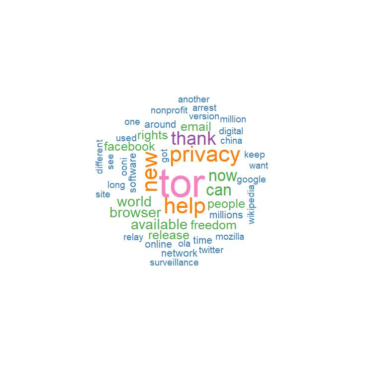

Pretty simple, right? Well, what we can see from this word cloud are some of the most commonly used words in our tweetsDF list. These are the words that have appeared at least 3 times in the past two months in @torproject’s tweets (3 is the default if min.freq is left blank). While the number of words listed are rather small, I think the ones displayed are useful. The one that really stands out is “tor” in pink. That’s the name of their free and open-source software for enabling anonymous communication. That’s what @torproject is all about, so it makes sense it would be the most commonly used word in their tweets. Other words that stand out are in orange: “new”, “privacy”, and “help”. Privacy is the main initiative behind the Tor Project, so it makes sense it would be a commonly used word. As Twitter is a platform to communicate that helps companies and individuals communicate with users, it seems like “new” could be related to @torproject reminding their users of new version releases of their software. Overall, I think a lot of the words included paint a decent picture. You can see words emphasized like: “world”, “browser”, “freedom”, “people” and “rights” which are all representative of @torproject. They provide a browser based on the Firefox framework to provide security and access to the Tor network. Due to tor’s network of nodes, they have global reach that is intended to bring people freedom and human rights to everyone. You can even see companies like “facebook” and “google” in there, as both have become controversial for their data privacy, and ethical reasons. While the data is rather small, this is a good representation of what the Tor Project stands for.

I tried modifying the word cloud attributes, and while decreasing the minimum frequency to two, more words were displayed. But I believe the word cloud above paints a much better picture than the following. 

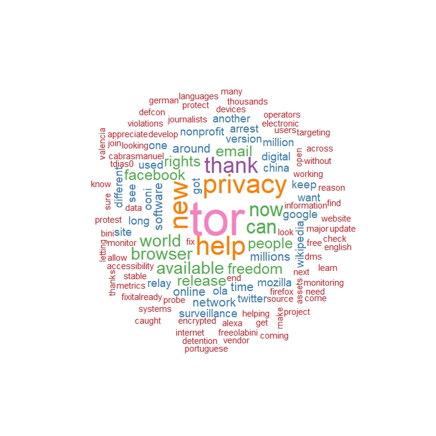

The words in red which were added as a result of a lower standard of appearance, seem to clutter up the image and are filled with words that are not as powerful. You see usernames and more common words that take away from the importance of those emphasized. For example the words “tdias0”, “cabrasmanuel”, “dms” and others don’t have as much of a meaning or a message as those near the heart of the circle. Lets try tweaking our word cloud again, but this time to show sentence fragments rather than individual words. The code below gives us a 3-gram word cloud.

```javascript
grams_3 <- tokenize_ngrams(tweetsDF$text, n = 3, n_min = 3,lowercase=TRUE)
unlist(grams_3)
g3<- table(unlist(grams_3))

set.seed(9999)
wordcloud(words=names(g3), freq=g3, scale=c(2, .4), random.order=FALSE,
          colors=brewer.pal(8, "PuBuGn"), random.color=FALSE, rot.per=0.22,
          min.freq=2, max.words=Inf)
```

Keeping the seed at 9999, we split our data into a 3-gram word cloud. Compared to our original word cloud method, we assigned the words with our new data, as well as changing the scale to fit the words in the display. We changed the color code for a better visualization, as well as removing random assignment of color. This means that the text color will be coordinated with word frequency and will change as positioning in the word cloud changes. We kept the same minimum frequency, to get a better range of data. In a short period of time, having strings of words repeat themselves is more significant than reoccurring words with no meaning. 

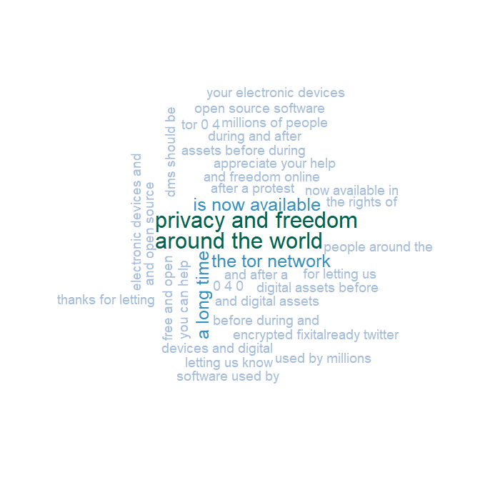

Immediately you can tell that changing the color code paints a much better picture of the data. Using the 3-gram word cloud style we can also get a better understanding of some of the individual words we saw in our previous word clouds. The first strings that stand out are “privacy and freedom” and “around the world”. These correlate to our previous individual words of “privacy”, “freedom” and “world” but now you can see more of the context behind it. Privacy and freedom as said before is Tor’s initiative, and they have a global reach due to the nodes that are spread “around the world”. I really like this representation of our timeline much better than the singular word cloud.

However, we need to remember that this data is only showing a glimpse of what @torproject is all about. Lets try to get a bigger picture using our tweetsFullDF data, which contains roughly 3,200 tweets dating back to 2017.

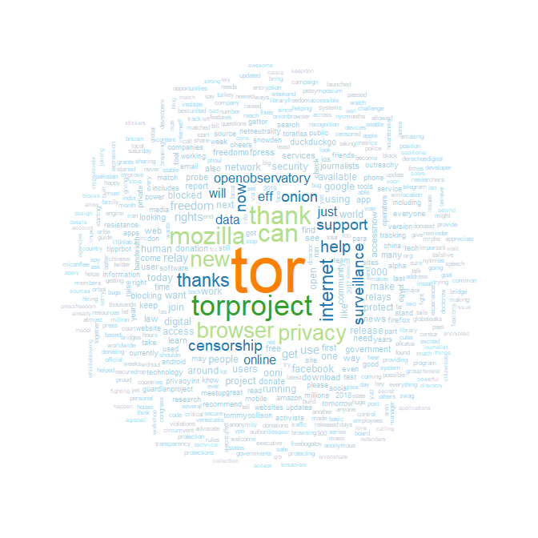

We used a similar word cloud formula from our first visualization but made some minor adjustments to better fit our data. Our minimum frequency is set to 3, due to the large amount of text data we have, as well as a maximum word restriction was set to 500.

Immediately you can notice similarities with our first visualization that had a tweet size of 91. The words “tor”, “thank”, “privacy”, “browser”, and “new” are all reoccurring and emphasized. However, we also have some new words added to the mix. We can see that “censorship”, “surveillance”, “onion”, “eff” and “mozilla” have been emphasized in our new word cloud. Censorship is something the tor browser aims to counteract and surveillance has been a prominent topic for news and ethic debates in technology, so it’s not surprising it has appeared numerous times in their tweets. Onion refers to the onion router, the anonymizing network which is the heart of the tor project. In fact, tor’s name is an acronym for the onion router. And Eff is a nonprofit organization which shares news regarding civil liberties and privacy in the technology sector. Mozilla is the framework on which the tor browser has been built, as it uses a modified version of Firefox. And we’ll see that Mozilla is more present in @torproject’s tweets when we look at a 3-gram word cloud for this data set. 

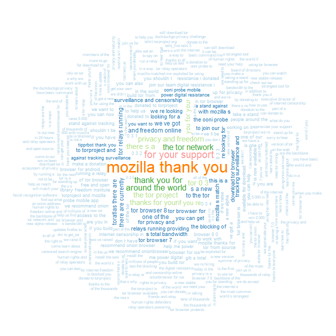

Lowering the maximum words and reducing the scale to allow us to display the abundance of words from our data set, gives us the above visualization. The first thing you can tell is that our most used word which was “tor” is no longer on the top (in the orange). Instead, we have “mozilla thank you” which I found rather surprising. The Tor Browser is mostly Mozilla’s Firefox browser, with some modifications and additions, but the majority of the code is the same. After seeing this phrase on the top of the word cloud, I did some research and found out that since 2016 Tor and Mozilla have been collaborating more than ever before. Firefox took an initiative to add more privacy options to the browser, as well as updating the patches Tor Browser uses with every version of Firefox. Since then the Tor Browser and Firefox teams have collaborated on numerous other projects. So it makes sense that within the past 2 years, “Mozilla thank you” would be the most used phrase in their tweets, since they owe so much to the developers behind the browser framework they use. Other than that the other words seem to express the same message we have gotten in our previous word clouds. Mainly focusing on updates, surveillance and censorship, and privacy and freedom. 


## The Tor Project and Current Events

Before we move away from @torproject’s timeline, I wanted to see if the tweets changed at all during any specific events in regard to privacy or security. I know from just using Tor and skimming their Twitter timeline that they tend to comment or retweet about issues when it comes to technology. This is either going to be very descriptive of the event we’re looking for, or look similar to our other word clouds just with a lot less words. 

A relatively current event was the arrest of WikiLeaks founder and journalist, Julian Assange. I took the timeline of  @torproject tweets for the month of April to see if there was any discussion regarding the charges against Assange. I didn’t expect many tweets to be present about Assange, hence why I didn’t just pull tweets that referenced him. I would have gotten two returned. There were a couple other news stories about whistleblowers in April, so I wanted to see what I would get returned if I just pulled the tweets for April. I used RStudio to save our cleaned-up data frame of 3,200 tweets as a CSV file. I then opened the CSV in Excel and converted the data into a table and filtered for the month of April. Afterwards I loaded the data back into RStudio, converted it to a data frame and created another word cloud. 

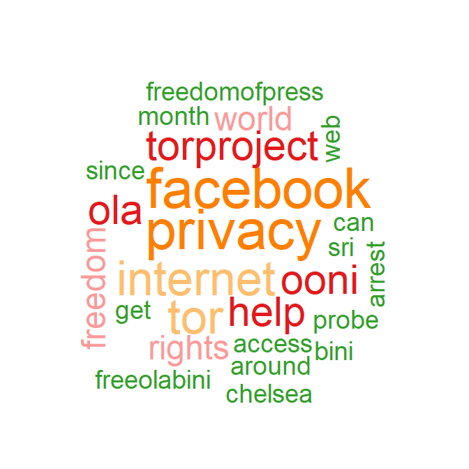

I did not really get what I was looking for. The minimum frequency was set at 2 and Assange did not appear on the word cloud. You do see “chelsea” which refers to Chelsea Manning, the whistleblower who has been cruelly detained. The only other words which really come close are “arrest” and “freeolabini” which stems from a hashtag #FreeOlaBini. Ola Bini was a Swedish programmer who was arrested in Ecuador for alleged links to Julian Assange and WikiLeaks. While those are present in the word cloud, they aren’t even the most emphasized as they were only briefly mentioned. “Facebook” and “privacy” are the most prominent as Facebook has constantly been in the news for privacy scandals and had a huge data breach in the beginning of April 2019. 

I overall did not get the message I was intending and upon further research discovered this was due to the fact that tweets regarding Assange’s arrest did not necessarily mention him. After the arrest was made public, @torproject tweeted: “Each arrest is disconcerting alone, and when taken together, there are grave implications for the future of internet freedom, press freedom, and human rights.” They then followed up with only a few tweets regarding Ola Bini, Assange and Chelsea Manning.


## The Tor Project and User Engagement

I mentioned earlier that one of my intentions of text mining @torproject was to see if users actually put proper security methods into practice. Something as simple as turning off your geo-location and not using your full real name are two that can go a long way to protecting yourself. I also wanted to see what kinds of people were engaging with @torproject to get a better understanding of their userbase. 

First we will pull tweets of users who have tweeted at the @torproject account. We can do this by utilizing the searchTwitter method. 

```js
totor2<-searchTwitter("to:torproject",resultType="recent", n=300)
totor3<-searchTwitter("to:torproject",resultType="popular", n=300)
totor2DF<-twListToDF(totor2)
totor3DF<-twListToDF(totor3)
```

We pull the tweets in two types of categories, recent and popular. We then convert it to a data frame so we can merge our lists and remove any duplicates. This data can be accessed from our TweetsToTor.Rdata file. 

```
totorfull<-rbind(totorDF,totor2DF,totor3DF)
totorfull<-totorfull[!duplicated(totorfull$id),] 	#removes duplicate IDs
```

We now have a list of nearly 230 unique tweets that have been tweeted to the Tor Project account. However, we’re interested in the users who have been engaging with the account. Lets make a frequency data frame so we can see which users have been tweeting the most to @torproject. 

```js
d<-as.data.frame(table(totorfull$screenName))
names(d)<-c("User","Tweets")
d<-d[order(d$Tweets, decreasing=TRUE), ]
```

This creates a new data frame with two columns, user and tweets. User contains the twitter screenname of the individual, while tweets contain the frequency, or number of tweets they have issued to @torproject. I set the order to decreasing, to display the users with the most tweets at the top of the data frame. This is useful when we plot our data. However, we still have a list of nearly 200 users, which needs to be cleaned up.

```
d <- d[!d$Tweets == 1,] 		#Removes all users who only tweeted at our user once
d <- d[!d$Tweets == 2,] 		#removes those who tweeted twice
d <- d[!d$User == "torproject",] 		#Removes our own user tweeting at themselves
```

We want users who have high engagement with the Tor Project, so we are going to select users who have tweeted at the account at least 3 or more times. To do so we will strip the users who have 1 or 2 tweets. We also do not want the Twitter account we are analyzing to come up, so we will remove it for consistency. Using the below code, we will plot our data on a bar plot.

```js
windows(width=1000, height=700)
par(mar=c(5,10,2,2))
barplot(d$Tweets, names.arg=d$User, col=c("#c671fe","#d59bfb","#e5befe","#f1ddff","#f2ffda"),
        horiz=TRUE, las=2, xlim=c(0,max(d$Tweets)), cex.names=0.7)
```

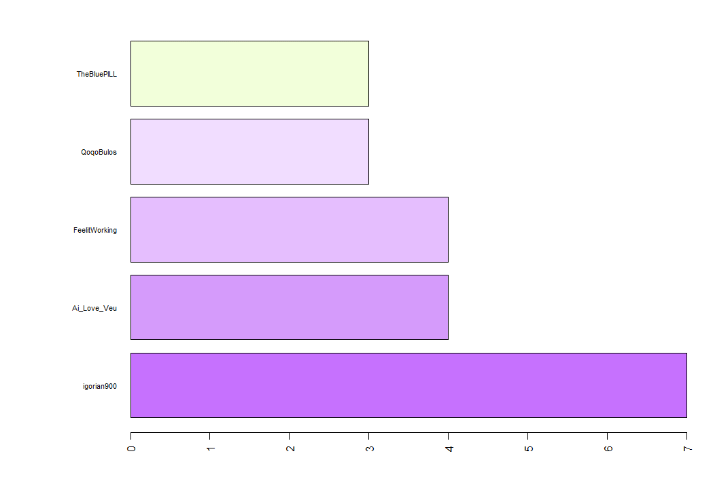

Now we can visually see which users tweet at the Tor Project the most. Igorian900 has the most tweets at 7, while Ai_Love_Vew and FeelitWorking are tied for second with 4. These three are the three twitter users we are going to focus on. Let’s run some code to get some more information on the bunch. This is the framework we will run for each of the three users listed above. 

```
igorian900<-getUser("igorian900")
str(igorian900)
igorian900$name
igorian900$description
igorian900$lastStatus$latitude    #returns 0, geo-location turned off

igor<-userTimeline(igorian900, n= 20, maxID=NULL, sinceID=NULL)
igorD<-twListToDF(igor)
View(igorD)
```

The first user we analyzed was igorian900. The name he uses is KDDRAZIWEHT, which is not his real name. His description is that of a self-proclaimed “#1 followed DJ from Denmark” with links to his music. By pulling tweets from his timeline and looking at the past 20, we see that he is a DJ who makes music and is a “hacktivist”. He regularly tweets out to Anonymous, a decentralized international hacktivist group which has mostly fallen apart in the past decade. And lastly, he has his geo-location turned off as none of his tweets include and latitude or longitude data. So, while the user might be… odd, he does the bare minimum for basic security and privacy. No full/real name, no location listed, and no geo-location data.

Next, we take a look at Ai_Love_Veu, using the same methods we did for KDDRAZIWEHT. This user is a junior staff member at a small pharmaceutical company in Vietnam. Their name is Thông tin Y-Dược, which stands for Medicine-Pharmacy Information. Their location in the bio is empty, and their geo-location is turned off as the longitude and latitude of the tweets are empty. The user has a link to a Vietnamese pharmaceutical website, but other than that nothing to identify who the user is. I used the searchTwitter method to see why this user was tweeting at the Tor Project, and it turns out that a computer in their possession has been encrypted and they are unable to decrypt it. It has something to do with an onion site hosted on a tor node, supposedly. 

Lastly, we look at FeelitWorking, whose name on Twitter is… aka James Bond. This is a user from New England, United Kingdom per their location attribute. This user’s description states “Ex-Neighbours/bent police&PSD Sgt lied. Illegal house search&arrest. Maliciously accused of using IMSI catchers,Bugs,CCTV,Tor&car hacking!NO Evidence-CLEARED”. Which leads me to assume he has had some legal trouble but got cleared due to a lack of evidence. This is also rather descriptive, which is not advised, nor is it a good look. This user has no geo-location on, so no location-based tweets. His tweets range from scam accusations and prevention to talking about how service providers are wronging him. He constantly posts dashcam footage of people who don’t follow the rules of the road and criticizes them publicly on twitter. He also regularly communicates with software accounts, like Tor, but more specifically one for a password management software.

In conclusion, it seems that all these users implement good security/privacy practices by not having too much personal information out there, as well as no location-based tweets. These weren’t really the users I were expecting to discover, but I am not surprised that they have geo-location turned off. I’m not sure if I’m just surprised or disappointed by the users who were tweeting at @torproject. I was expecting more professional or normal people, too be honest.


## The Tor Project and Other Software Accounts

The data that I have gathered so far has not been what I expected. For the most part, Tor maintains its status as an open source software project that aims to bring privacy and freedom to the world. However, apart from software updates and the retweet or comment on a current event, the Tor Project does not have the richest tweets for text mining. The users, well the few who do engage with the account frequently, all practice decent security measures and at the least, have turned geo-location off. Since I’m deep into this project, and the content is not as rich as I expected, I have come up with another idea. The @torproject is a media account intended to engage with their users and communicate software updates and features, as well as attract new users. This is common amongst software and developers. Therefore, I wanted to see how Tor’s timeline compared to similar software media accounts’ timelines. I will use the twitter timelines from Firefox, an open source browser who collaborates with the Tor Project; Tails, a live operating system that aims to preserve privacy and anonymity; and OpenVPN, a virtual private network service for secure communications and internet privacy. 

I pulled tweets for each of the twitter accounts. I gathered 3,200 tweets for Firefox, located in firefoxtweets.Rdata, 478 tweets for Tails which can be found in tailstweets.Rdata, and 835 tweets for OpenVPN, located in openvpnTweets.Rdata. I used the same functions defined earlier to clean up the data. We already know what Tor’s timeline looks like but let’s see how it compares to the other twitter accounts, using a comparison cloud. 

```
	# create corpus
corpus = Corpus(VectorSource(all))
   	# create term-document matrix
tdm = TermDocumentMatrix(corpus)
 	# convert as matrix
tdm = as.matrix(tdm)
    	# add column names
colnames(tdm) = c("Tor", "Firefox", "Tails", "OpenVPN")
# comparison cloud
windows()
comparison.cloud(tdm,scale=c(5, .4), random.order=FALSE,
                 colors = c("#00B2FF", "red", "#FF0099", "#6600CC"), min.freq=2,
                 title.size=1.5, max.words=200)
```

In the above code I take my tweets which I cleaned and merged into a single vector and place them in a corpus. Afterwards, I create a term-document matrix, to then convert to a matrix. I add the column names and plot the comparison cloud. 

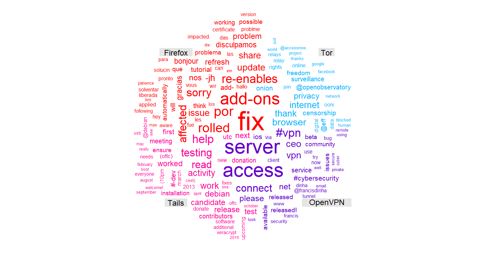

This essentially displays a cross section of all four groups of tweets against each other. Each set ahs their own corner where the most prominent words are displayed. You can compare them to each other in a better picture than looking from one-word cloud to another. I removed lots of stop-words as well as any undesirables like error codes which did not fit into the mix. Essentially you see that Firefox mostly discusses development regarding their software, and posts updates and fixes for their platform. You also see a bit of Spanish and French, since they communicate to their users in whichever language requested. Tails is similar, but mostly focuses on testing and planning. They mention releases and work, as well as “Debian” which is what Tails is based off, as it’s a Debian based Linux distribution operating system. OpenVPN is not surprising either, talking about servers, access and connection. As a virtual private network, these are the prime attributes of the software. Now that we have seen the differences between the four twitter pages, what is similar?

```
# commonality cloud
windows()
commonality.cloud(tdm, random.order=FALSE,
                  colors = brewer.pal(8, "Dark2"),
                  title.size=1.5)
```

The code above takes our data and plots a commonality cloud. This will show us all the reoccurring words between our four groups in a single word cloud. 

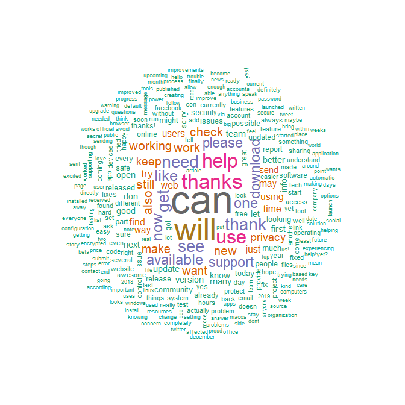

A lot of the words are similar and can be expected. As all the pages are essentially meant to serve as a communication points for updates and to interact with customers, it’s not a surprise words like “can” and “thanks” are on top of the word cloud. This is because if these Twitter accounts are communicating with users, these support and customer assurance words are going to be the most common. Also thanking users for their support and donations as well. 


## Privacy and Security on Twitter

Since the scope of my project of analyzing the Tor Project wasn’t that grand, I thought I would see the discussion around privacy and security on Twitter, since it’s in the same sector. 

```js
pstweets<-searchTwitter("privacy AND security", n=50)
length(pstweets)
pstweetsDF<-twListToDF(pstweets)
```

I pulled tweets using the searchTwitter method and specified the criteria to “privacy AND security”. I initially pulled 500 words but between the run time to load the visualization of the data, as well as the huge cluster of words it displayed, I reduced the number to 50. It makes the visualization a little easier to read. The tweets can be found in pstweets.Rdata. Afterwards, I used the same functions defined above to clean up the code before creating a corpus. 

```
# create corpus
corpus = Corpus(VectorSource(pstweetsDF$text))
tdm = TermDocumentMatrix(corpus)	 # term-document matrix
m = as.matrix(tdm) 	# convert tdm to matrix
wc = rowSums(m)	 # word counts
lim = quantile(wc, probs=0.5) 	# get those words above the 3rd quantile
good = m[wc > lim,]
good = good[,colSums(good)!=0]	 # remove columns (docs) with zeroes
M = good %*% t(good)	 # adjacency matrix
diag(M) = 0	# set zeroes in diagonal
kmg = kmeans(M, centers=8) 	# let's superimpose a cluster structure with k-means clustering
gk = kmg$cluster
```

I created a corpus using the cleaned-up text and removed any stop words. Afterwards, I created a term-document matrix which I then converted to a matrix. And created a word count for the number of rows. I chose to get the words above the 3rd quantile since it becomes the most relevant and removed columns with any zeroes. I created a layout for the graph using adjacency and then superimposed a k-means cluster on our corpus. The code in the root Rdata file has the complete code, but afterwards colors were created for each cluster file and different attributes were assigned to the plot.

```
# graph
g = graph.adjacency(M, weighted=TRUE, mode="undirected",
                    add.rownames=TRUE)
# layout
glay = layout.fruchterman.reingold(g)
windows()
plot(g, layout=glay)
title("\nGraph of tweets about privacy and security",
      col.main="gray40", cex.main=1.5, family="serif")
```

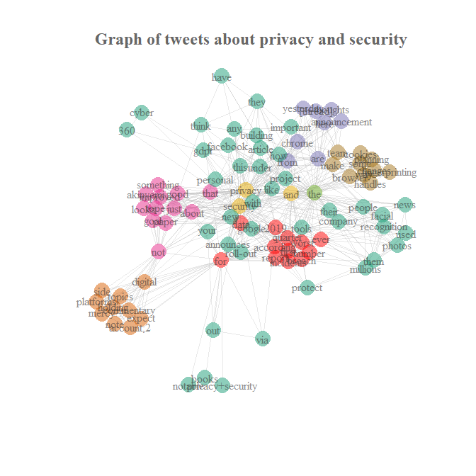

The result of this is iffy, and the code above probably needs to be refined. However, this graph is supposed to show associations between different words that are being discussed around the words I selected, privacy and security. In the bottom right you can see that “protect” is associated with “them” and “millions”, so in the context it was talking about protecting others or millions of people. You can also see corporation names Google and Facebook tied in here, and with “personal”. But looking at “personal” you can see that it is connected to “gdpr”, which stands for General Data Protection Regulation. This is a regulation in EU law on data protection and privacy for all individuals within the European Union and the European Economic Area. It makes sense, since it is linked to the “personal” bubble.

## Conclusion
Looking at the data I have collected, I am not sure what I expected. My intentions were to bring more awareness to privacy and data security by presenting on a software which is notable in both. However, I’m not sure it was a good Twitter account to mine tweets from as it’s a software media account, so they post mostly version updates and features, as well as the occasional retweet or comment on a current event. From the data I conclude, that if most users are taking the trouble to use the software, then they are more than likely already practicing decent security methods. Even something as simple as turning off geo-location can go a long way to protecting yourself. 
