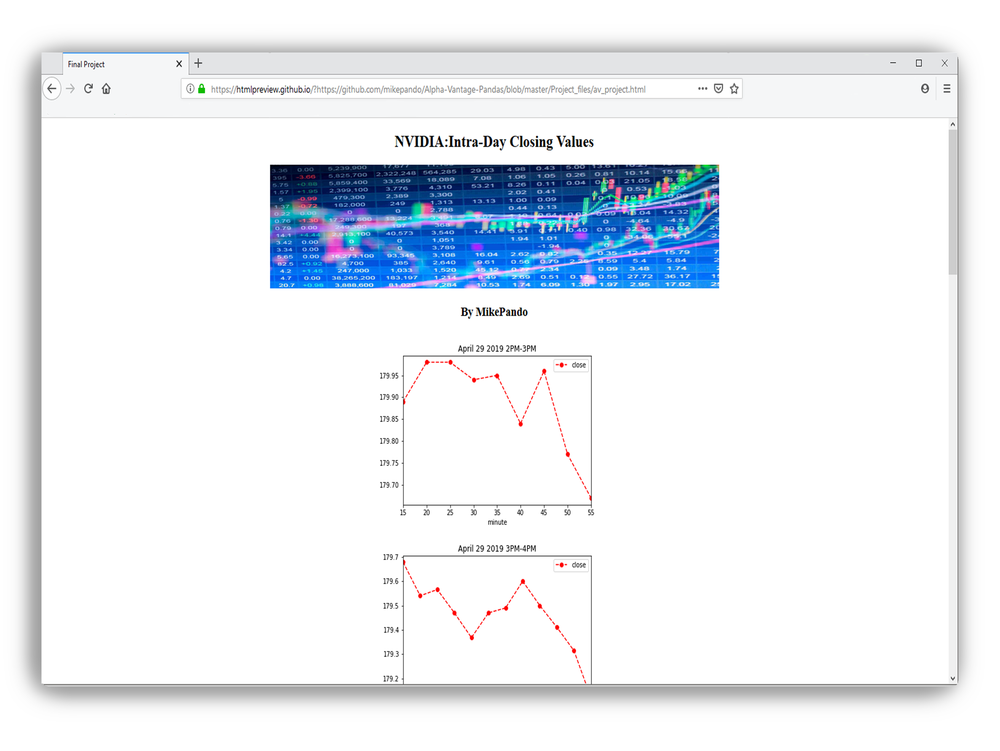

This project utlizes [Alpha Vantage](https://www.alphavantage.co/), an API library for financial data, alongside [Pandas library](https://pandas.pydata.org/), which features data structure and data analysis tools. Using these libraries, we are able to gather and plot the intra-day closing values of a designated public company.

In this project I gained experience manipulating data frames and visualizing the outcome through the Pandas library. 

Using stock data, I was able to manipulate the timestamp to display hourly data for two intra-day closing values, and then plot the resulting values. A for-loop was used to plot the values for the numerous stock hours per day, and then write the plots to the web page.  

Source: <a href="https://github.com/mikepando/Alpha-Vantage-Pandas"><i class="large github icon "></i>mikepando/Alpha-Vantage-Pandas</a>
