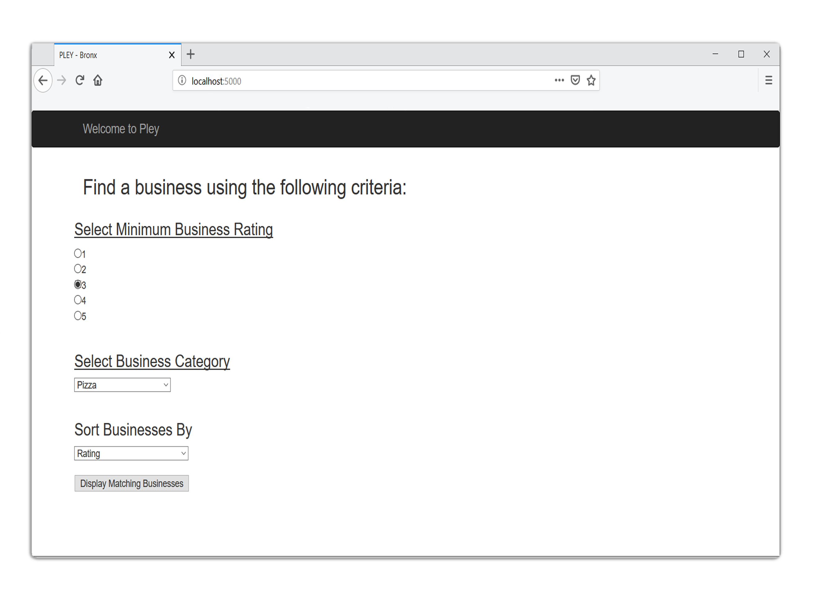
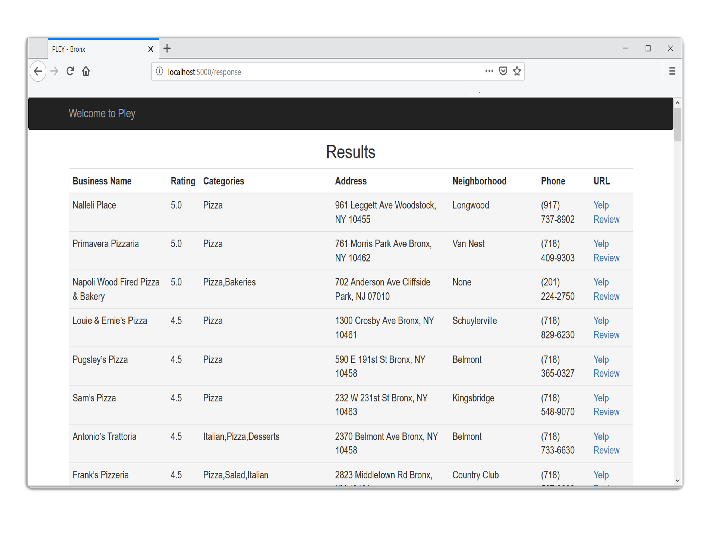

 

This is a project utilizing Flask and SQLite to allow us to search a database using Python. [Flask](http://flask.pocoo.org/), is a microframework used for local server. [SQLite](https://www.sqlite.org/index.html) is the library used to issue queries to the database.

The web page displays adjustable search criteria and issues a request for the corresponding data from the database. The results are displayed on a secondary web page. 

The database contains around 100 restaurant records scraped from Yelp.

Here is an example of how queries are issued to the database based upon the given criteria:



```python
def response():
    minRating=request.form["minRating"]
    category=request.form["category"]
    sorting=request.form["sorting"]
    if sorting=='rating':
        sortstring='rating DESC'
    elif sorting=='neighborhood':
        sortstring='neighborhood'
    else:
        sortstring='rating DESC, neighborhood ASC'
    db = get_db()
    cursor = db.cursor()
    dataList=cursor.execute("select * from company where rating>="+minRating+" and category like '%"+category+"%' order by "+sortstring).fetchall()
    return render_template('results_page.html',data=dataList)
```

Source: <a href="https://github.com/mikepando/yelpDB-Flask-SQLite"><i class="large github icon "></i>mikepando/yelpDB-Flask-SQLite</a>
