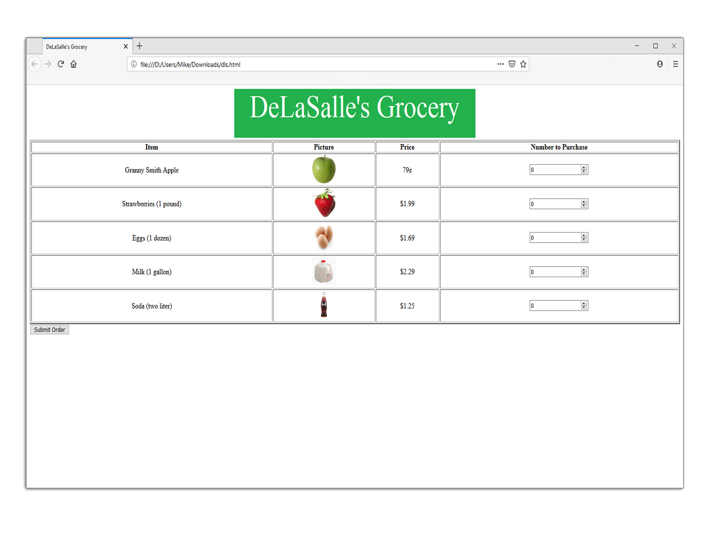

 

The project was intended to test Python code with user input on a local server. It accepts user input of quantity, the number of items to purchase, and displays it on a billing page with its respective costs. The code also prevents users from entering a negative quantity, converting inconsistencies to 0.

In this project I gained experience running a server using Flask, and requesting and interpreting data from user input in python. 

This project utlizes [Flask](https://www.alphavantage.co/), which is a microframework used for local server.

Source: <a href="https://github.com/mikepando/Grocery-w-Flask-Python"><i class="large github icon "></i>mikepando/Grocery-w-Flask-Python</a>

