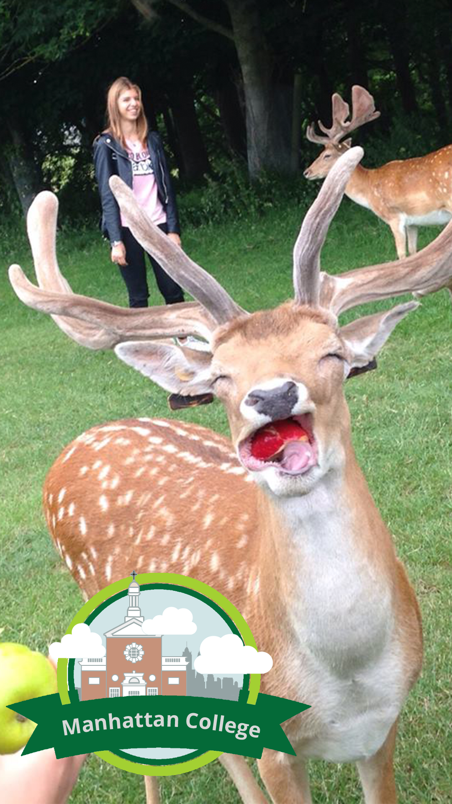

 

I designed a geofilter for the multimedia messaging app, Snapchat. 

I wanted to create a good representation of Manhattan College, that would allow Snapchat users to express their school pride. 

I used Adobe Photoshop to design the filter, as I was most comfortable with the program at the time. However, this should have been made in Illustrator, not rasterized in photoshop.

The Chapel is a notable part of Manhattan College as it is the center of the campus, next to the Quad. I recreated the building by hand, using numerous vectors and layers.

*This filter has been publicly available around the Manhattan College campus since 2016. As a community filter, this had to be submitted and approved by Snapchat.*

