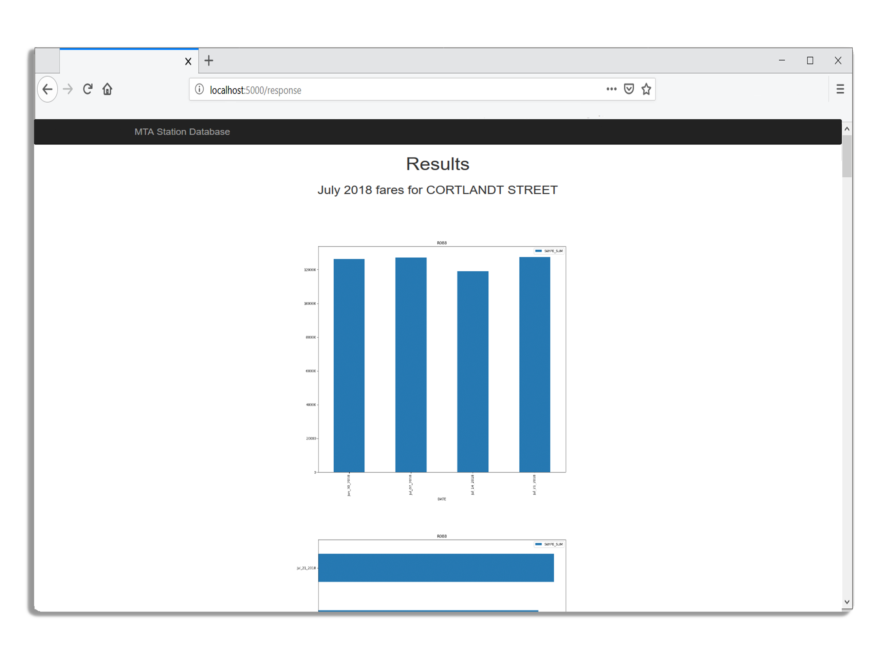

A Python project utilizing the Flask microframework and Pandas library to search the MTA website for the number of MetroCard swipes at each of New YorkCity’s subway stations.

 


I designed a main and response page using HTML and Bootstrap CSS, that allows users to select search criteria to display the corresponding swipe totals.

Incorporated Flask for hosting the main and response webpages on local server, and the Pandas library to interpret the CSV data on the MTA website, as well as data visualization.

This project uses the public fare data files located on the [MTA's Website](http://web.mta.info/developers/fare.html), which are updated every Saturday. 

Not every month begins on a Saturday, so we use the following code to determine the proper Saturday to use, based on the start day of the month:

```python
def dayWeek(startDate):
    weekDay=startDate.weekday() 
    if (weekDay == 2 or weekDay == 3 or weekDay == 4):
        if weekDay == 2:
            time = 3
        elif weekDay == 3:
            time = 2
        else:
            time = 1
        days = dt.timedelta(days=time)
        startDate = startDate + days
    elif(weekDay == 6 or weekDay == 0 or weekDay == 1):
        if weekDay == 6:
            time = 1
        elif weekDay == 0:
            time = 2
        else:
            time = 3
        days = dt.timedelta(days=time)
        startDate = startDate - days
return startDate
```

Source: <a href="https://github.com/mikepando/mta-station-data"><i class="large github icon "></i>mikepando/mta-station-data</a>
